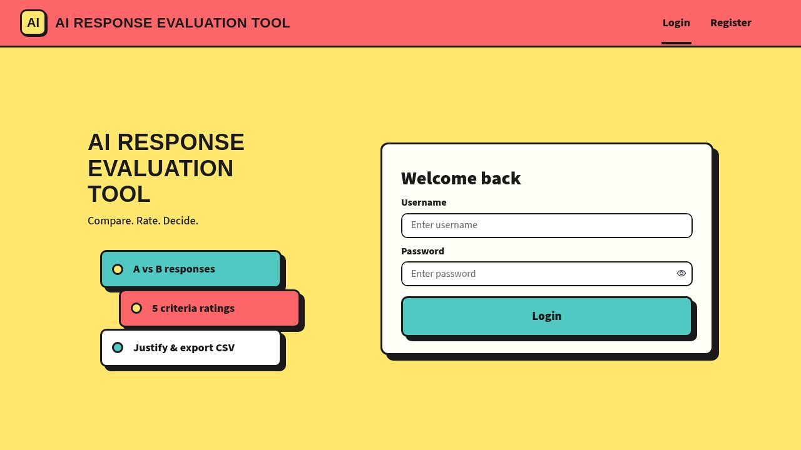
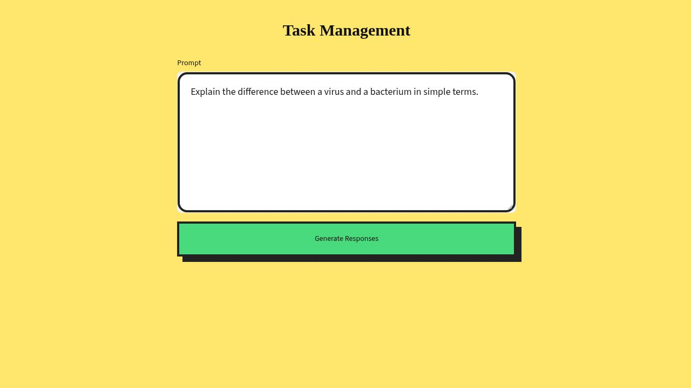
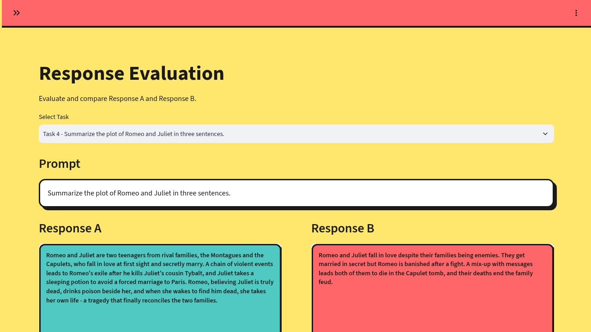
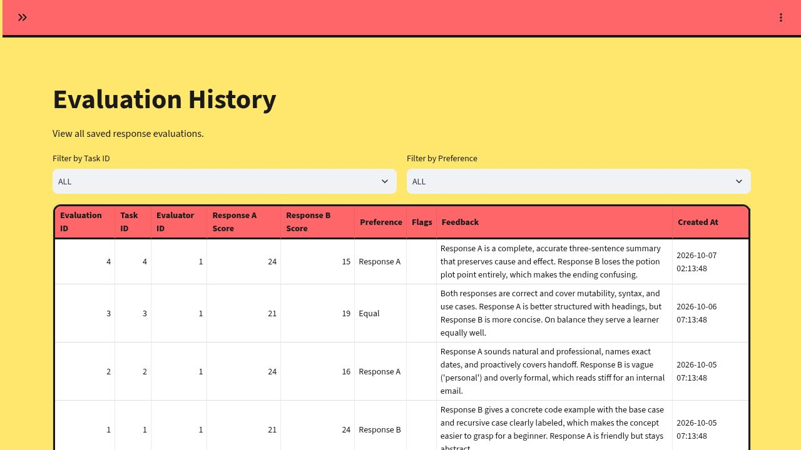
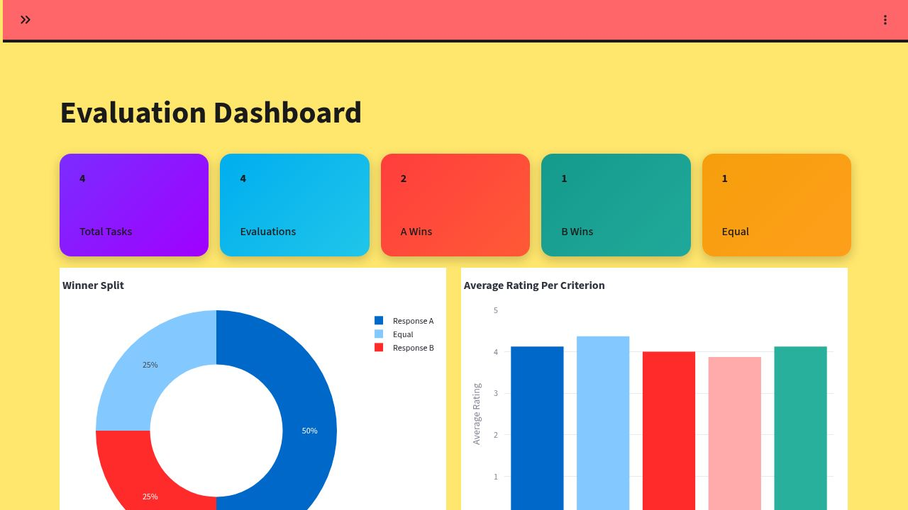

# AI Response Evaluation Tool

A Streamlit web app for evaluating and comparing AI-generated responses, inspired by real-world AI data annotation workflows (A/B response rating).

Evaluators compare two AI responses to the same prompt, rate them across five quality criteria, pick a winner, and track results on a live dashboard.

## Features

- **User accounts** - secure registration and login with bcrypt-hashed passwords
- **Task management** - enter a prompt and generate two responses from different AI models (Groq and Cloudflare Workers AI), then save them as evaluation tasks
- **Structured evaluation** - rate both responses from 1 to 5 on correctness, relevance, clarity, completeness, and instruction following
- **Final judgment** - pick a preference (Response A / Response B / Equal / Both Poor), flag quality issues, and add written feedback
- **Evaluation history** - filter by task or preference, inspect score breakdowns, and export to CSV
- **Dashboard** - live stats, winner-split donut chart, and average rating per criterion

## Tech Stack

- **Python** with Streamlit for the UI
- **SQLite** for storage
- **bcrypt** for password hashing
- **Pandas and Plotly** for analytics and charts
- **Groq API** and **Cloudflare Workers AI** for response generation

## Setup

1. Clone this repository:

   ```bash
   git clone <your-repo-url>
   cd Ai_Response_Evalution_Tool
   ```

2. Install the dependencies:

   ```bash
   pip install -r requirement.txt
   ```

3. Add your API keys to `.streamlit/secrets.toml`:

   ```toml
   GROQ_API_KEY = "your-groq-key"
   CLOUDFLARE_API_TOKEN = "your-cloudflare-token"
   CLOUDFLARE_ACCOUNT_ID = "your-cloudflare-account-id"
   ```

4. Run the app:

   ```bash
   streamlit run Home.py
   ```

## Usage

1. Register an account and log in
2. On **Task Management**, enter a prompt and generate two responses
3. Save the task, then open **Evaluation** to rate both responses
4. Review past work in **Evaluation History** and export it as CSV
5. Track overall stats on the **Dashboard**

## Screenshots

<!-- Add screenshots of the login page, task management, evaluation, and dashboard here -->











